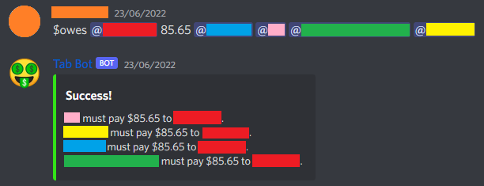
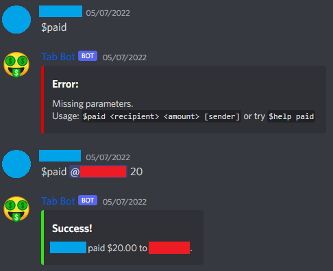
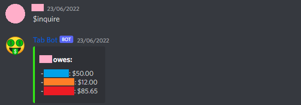

# Tab Bot for Discord

A Discord bot using the Discord.py API, useful for keeping track of who owes who in a group of friends. It will send helpful error messages for wrong command usage, and has many commands that can be called multiple ways to allow for easier usage. If two people owe each other, the tab will be set to the difference. 

## Commands
 - `$owes`:        Records that a user owes someone an amount
 - `$owes_me`:     Records that a user owes you an amount
 - `$divide`:      Divides a bill evenly among listed users
 - `$paid`:        Marks that someone has paid their tab
 - `$inquire`:     Determines how much you owe everyone else
 - `$who_owes_me`: Determines how much everyone else owes you
 - `$help`:        Shows a list of commands and their functions

### Owing Someone With `$owes` and `$owes_me`

```
$owes <recipient> <amount> <user>...
$[owes_me|owesme] <amount> <user>...
```
This command is run to record that a user owes an amount to someone. Using `$owes_me` (or its alias `$owesme`) indicates you are the one who is owed the money. You can also list multiple users to indicate that each user listed owes the recipient the indicated amount. 



### Dividing a bill with `$divide`

```
$divide <recipient> <amount> <users>...
```

If a group of people attend some paid event (like eating at a restaurant, for example) and want to **equally** divide the bill, the `$divide` command is useful. At the event itself, one person pays for everything and then the remaining participants will owe them a fraction of the amount. Though this is a bit more complicated of a command, a manual bill divide can be performed using the `$owes` function.

Eg. ```$divide @friend1 30 @friend2 @friend3``` would result in both friend2 and friend3 owing $10 to friend1.

### Clearing a Tab With `$paid`

```
$paid <recipient> <amount> [sender]
```
Record that a tab has been paid with this command. Marks that `sender` has paid the specified amount to `recipient`. Alternatively, `sender` can be left unspecified if person calling the command is the one paying. 



A person is allowed to "overpay" their tab, without this creating a new debt in the other direction. This is because people may want to overpay out of kindness. It also allows for an easy method to pay the whole tab without having to remember the exact number.

### Getting Information Using `$inquire` and `$who_owes_me`

```
$inquire [user]
$[who_owes_me|whoowesme]
```

Use the command `$inquire` to see what you owe, or specify a user to perform an inquiry on. Use `$who_owes_me` (or its alias `$whoowesme`) to see how much is owed to you. Tabs are only shown if it is between two users who are both in the present server. But to get more information on tabs you might have with everyone in Discord, you can make an inquiry in the bot's DMs.


